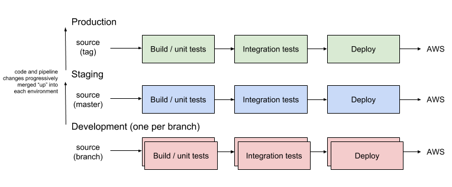

`opolis/build` Overview
=======================

Generally, we want to deploy software in a sequence of *stages*, called a *pipeline*, that can be monitored and
verified. Typically, we need a **build** stage, where our code and dependencies are compiled, a **test** stage, where
the compiled assets are put under some type of testing and validation, and a **deploy** stage where build output is
sent to some location for storage or execution. If any particular stage fails, the ones after do not run.

This deployment model is important because it helps us push code through to production in a way that is
repeatable and verifiable.

Setting up a series of deployment stages in and of itself isn't terribly complicated, and there are a lot of great
tools out there to help us do this (e.g. AWS CodePipeline). Things start to get messy when we want to have *multiple
copies*, or *environments* of this pipeline. Obviously, the production pipeline is the most important, and a
staging pipeline typically exists to ensure changes are stable before promoting to production, but what about
development environments?

Many teams share one development environment, which can create coordination and configuration problems if two or
more developers want to simultaneoulsy test their changes. To alleivate this problem, `opolis/build` makes sure
that for every unique development branch that exists in GitHub, this is also a corresponding deployment pipeline.

This way, developers can independently test and verify changes on their own time, and with wildly varying
configurations, without having to worry about configuration drift in the development environment, or coordinating
deployment cycles.

After changes to the repository's codebase and/or deployment pipeline (it's code too!) have been made and verified in
a development branch, merges into master propogate "upward" to the staging pipeline. More testing can be done there to
ensure changes are continuously integrated successfully with other work, and are safe to deploy to production.

Once a release event has been triggered, a repository's latest commit on the `master` branch can be tagged, and
promoted to the production environment. The specification for the pipeline itself will determine the type of deployment
that is made, and if any specific steps must be taken to ensure the code is properly deployed
(e.g. blue/green deployments, load balancer registration, etc). `opolis/build` just makes sure that pipeline is
triggered for every tag on GitHub.
